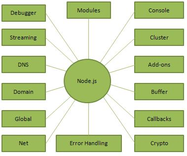

What is Node.js?
Node.js is a server-side runtime environment built on Google Chrome's JavaScript Engine (V8 Engine). Node.js was developed by Ryan Dahl in 2009 and its latest version is v20.9.0. Node.js is a cross-platform (run on Windows, Linux, Unix, macOS, and more), open-source, back-end JavaScript runtime environment, that executes JavaScript code outside a web browser.

The definition of Node.js as supplied by its official documentation is as follows −

Node.js is a platform built on Chrome's JavaScript runtime for easily building fast and scalable network applications. Node.js uses an event-driven, non-blocking I/O model that makes it lightweight and efficient, perfect for data-intensive real-time applications that run across distributed devices.

Node.js environment is event-driven and provides non-blocking I/O, that optimizes throughput and scalability in web applications. The OpenJS Foundation, facilitated by the Linux Foundation's Collaborative Projects program, now handles the Node.js distributed development.

Features of Node.js
Following are some of the important features that make Node.js the first choice of software architects.

Asynchronous and Event Driven − All APIs of Node.js library are asynchronous, that is, non-blocking. It essentially means a Node.js based server never waits for an API to return data. The server moves to the next API after calling it and a notification mechanism of Events of Node.js helps the server to get a response from the previous API call.

Very Fast − Being built on Google Chrome's V8 JavaScript Engine, Node.js library is very fast in code execution.

Single Threaded but Highly Scalable − Node.js uses a single threaded model with event looping. Event mechanism helps the server to respond in a non-blocking way and makes the server highly scalable as opposed to traditional servers which create limited threads to handle requests. Node.js uses a single threaded program and the same program can provide service to a much larger number of requests than traditional servers like Apache HTTP Server.

No Buffering − Node.js applications never buffer any data. These applications simply output the data in chunks.

License − Node.js is released under the MIT license.
The following diagram depicts some important parts of Node.js which we will discuss in detail in the subsequent chapters.

Where to Use Node.js?
Following are the areas where Node.js is proving itself as a perfect technology partner.

I/O bound Applications

Data Streaming Applications

Data Intensive Real-time Applications (DIRT)

JSON APIs based Applications

Single Page Applications

However, it is not advisable to use Node.js for CPU intensive applications.

Node.js is primarily used to build network programs such as Web servers. However, you can build different types of applications such as command line applications, web applications, real-time chat applications, REST APIs etc.

Thousands of open-source libraries for Node.js are available, most of them hosted on the npm website, npm is a package manager for the JavaScript programming language. A number web frameworks can be used to accelerate the development of applications. Some of the popular frameworks are Express.js, Feathers.js, Koa.js, Sails.js, Meteor, and many others.

Number of IDEs such as Atom, JetBrains WebStorm, NetBeans, and Visual Studio Code support development of Node.js applications. Cloud-hosting platforms like Google Cloud Platform and AWS Elastic Beanstalk can be used to host Node.js applications.

